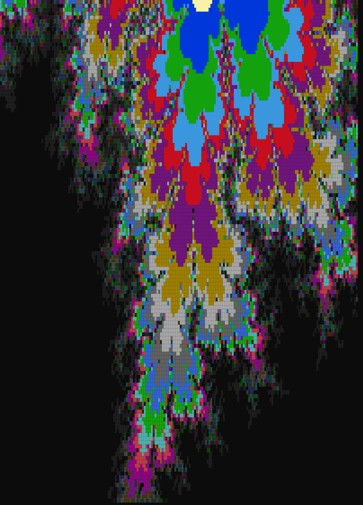

# Fractal Gallery
Some fractal screenshots from my ASCII fractal viewer. It runs in the console, and the blocky appearance from the ASCII characters give the pictures a unique appearance (in my opinion). The code for it is quite messy at the moment, however I will probably get around to cleaning it up and adding it to this repository in the future.

## Examples
  
   
   
  
